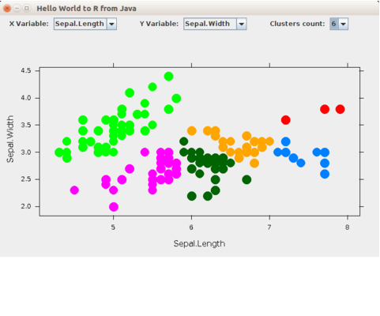
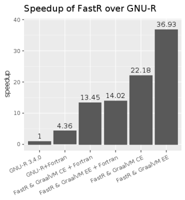

A high-performance implementation of the R programming language, built on GraalVM.

FastR aims to be:
* [efficient](https://medium.com/graalvm/faster-r-with-fastr-4b8db0e0dceb#4ab6): executing R language scripts faster than any other R runtime and as fast as `Rcpp`
* [polyglot](https://medium.com/graalvm/faster-r-with-fastr-4b8db0e0dceb#0f5c): allowing fast [polyglot interoperability](https://www.graalvm.org/reference-manual/polyglot-programming/) with other languages in the GraalVM ecosystem.
* [compatible](https://medium.com/graalvm/faster-r-with-fastr-4b8db0e0dceb#fff5): with the reference R implementation including the [R extensions C API](https://cran.r-project.org/doc/manuals/r-release/R-exts.html)
* [embeddable](https://github.com/graalvm/examples/tree/master/r_java_embedding): allowing integration using the R embedding API or the GraalVM polyglot embedding SDK for Java


The screenshot below shows Java application with embedded FastR engine.
The plot below was generated by `ggplot2` running on FastR and it shows
peak performance of the [raytracing example](http://www.tylermw.com/throwing-shade/).
The measurements were [reproduced independently](https://web.archive.org/web/20181017111641/https://nextjournal.com/sdanisch/fastr-benchmark).




 ## <a name="getting_started"></a>Getting Started
See the documentation on the GraalVM website on how to [get GraalVM](https://www.graalvm.org/docs/getting-started/) and [install and use FastR](https://www.graalvm.org/reference-manual/r/).

```
$JAVA_HOME/bin/R
Type 'q()' to quit R.
> print("Hello R!")
[1] "Hello R!"
>
```

## Current Status

The goal of FastR is to be a drop-in replacement for GNU-R, the reference implementation of the R language,
including the [R extensions C API](https://cran.r-project.org/doc/manuals/r-release/R-exts.html).
FastR faithfully implements the R language, and any difference in behavior is considered to be a bug.

### CRAN Packages
FastR can currently install and run basic examples of many of the popular R packages,
such as `ggplot2`, `jsonlite`, `testthat`, `assertthat`, `dplyr`, `knitr`, `Shiny`, `Rcpp`, `quantmod`
and more… However, one should take into account **the experimental state of FastR**,
there can be packages that are not compatible yet, and if you try FastR on a complex R application,
it can stumble on those. If this happens please submit an issue on GitHub.

To provide better stability, FastR uses by default a [fixed snapshot](https://github.com/oracle/fastr/blob/master/com.oracle.truffle.r.native/Makefile#L37) of CRAN (via [MRAN](https://mran.microsoft.com/)). Function `install.packages` therefore does not install the latest versions. This can be overridden by
passing `repos` argument to `install.packages` pointing to CRAN.

FastR provides its own replacements for `rJava` and `data.table` packages,
which can be installed with `install.fastr.packages(c("rJava", "data.table"))`.

### Native extensions performance
Packages that use the [R extensions C API](https://cran.r-project.org/doc/manuals/r-release/R-exts.html) in hot paths,
especially via `Rcpp`, **may exhibit slower performance** on FastR due to the high cost of transitions between the native and managed code.
This can be mitigated by using the Graal LLVM runtime. Preview of the support is available via the `--R.BackEnd=llvm` option.
Note that most of the times FastR running R code equivalent to given `Rcpp` code is as
fast as GNU-R/Rcpp and sometimes even faster because of the advanced optimizations of the GraalVM dynamic compiler.

## Documentation

The reference manual for FastR, which explains its advantages, its current limitations, compatibility and additional functionality is available on the [GraalVM website](https://www.graalvm.org/reference-manual/r/).

Further documentation, including contributor/developer-oriented information, is in the [documentation folder](documentation/Index.md) of this repository.

## Stay connected with the community

See [graalvm.org/community](https://www.graalvm.org/community/) on how to stay connected with the development community.
The discussion on [Slack](https://www.graalvm.org/slack-invitation/) is a good way to get in touch with us.

We would like to grow the FastR open-source community to provide a free R implementation atop the Truffle/Graal stack.
We encourage contributions, and invite interested developers to join in.
Prospective contributors need to sign the [Oracle Contributor Agreement (OCA)](https://oca.opensource.oracle.com/).
The access point for contributions, issues and questions about FastR is the [GitHub repository](https://github.com/oracle/fastr).

## Authors

FastR is developed by Oracle Labs and is based on [the GNU-R runtime](http://www.r-project.org/).
It contains contributions by researchers at Purdue University ([purdue-fastr](https://github.com/allr/purdue-fastr)), Northeastern University, JKU Linz, TU Dortmund and TU Berlin.  

## License

FastR is available under a GPLv3 license.

